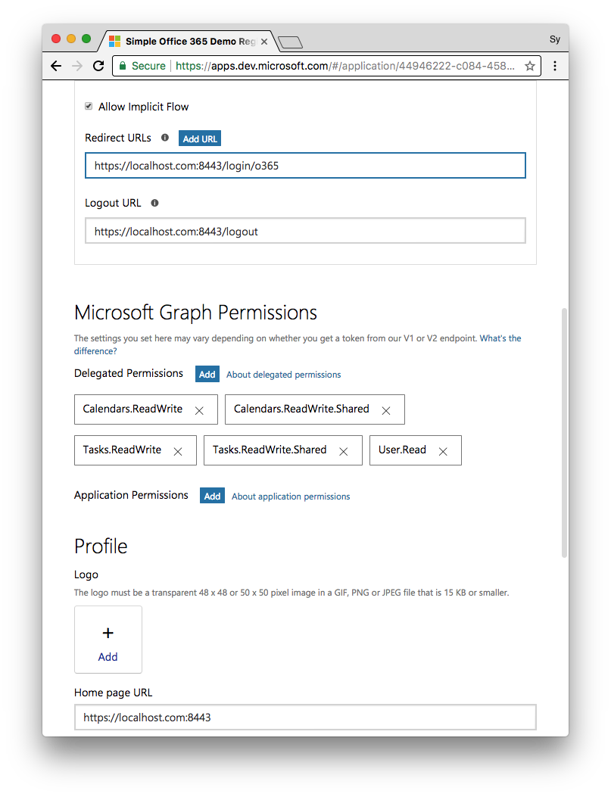
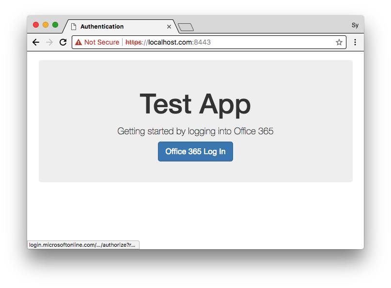
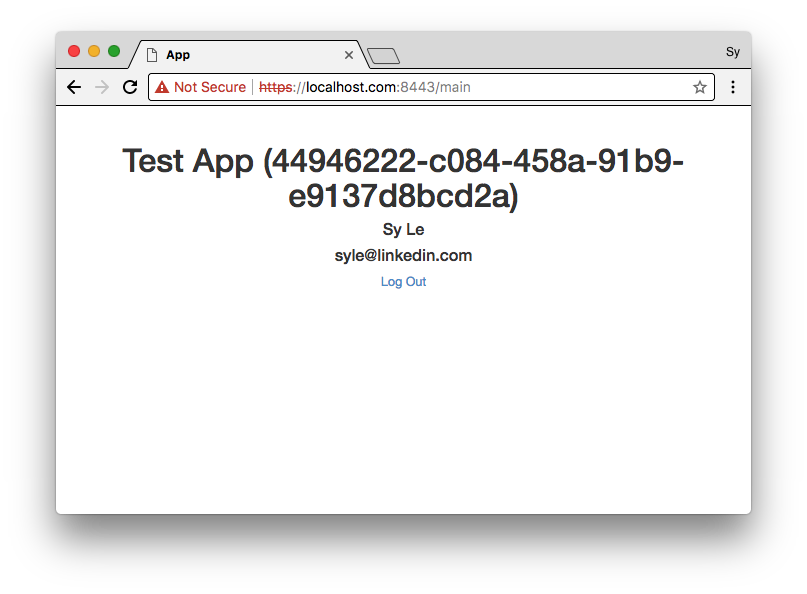

# simple-oauth-node-webapp

### Sample Screenshot:



## Environment Variable
Please check env.sh.bak (https://github.com/synle/simple-oauth-node-webapp/blob/master/env.sh.bak) for more information


## nginx
nginx is used here for basic https server...

### Basic Commands
```
sudo nginx
sudo nginx -s stop
```


### Config Path
#### Mac
```
/usr/local/etc/nginx/nginx.conf
```


### Sample nginx config for https
```
worker_processes  1;

events {
    worker_connections  1024;
}


http {
    include       mime.types;
    default_type  application/octet-stream;
    #access_log  logs/access.log  main;

    sendfile        on;
    #tcp_nopush     on;

    keepalive_timeout  65;

    proxy_buffering off;
    fastcgi_buffers 16 16k;
    fastcgi_buffer_size 32k;
    proxy_buffer_size   128k;
    proxy_buffers   4 256k;
    proxy_busy_buffers_size   256k;

    server {
        listen       8443;
        server_name  localhost;
        ssl on;
        ssl_certificate ./cert/server.crt;
        ssl_certificate_key ./cert/server.key;
        location / {
            proxy_pass      http://127.0.0.1:8080;
        }
    }


    include servers/*;
}
```


## Screenshots




## Sources / References
### Office 365
- App Config URL (https://apps.dev.microsoft.com)

### Google
- Doc (https://developers.google.com/identity/protocols/OAuth2WebServer)
- Scope (https://developers.google.com/identity/protocols/OAuth2WebServer)


## Gotcha's
- Google Refresh Token is only present for the first time user login attempts.
